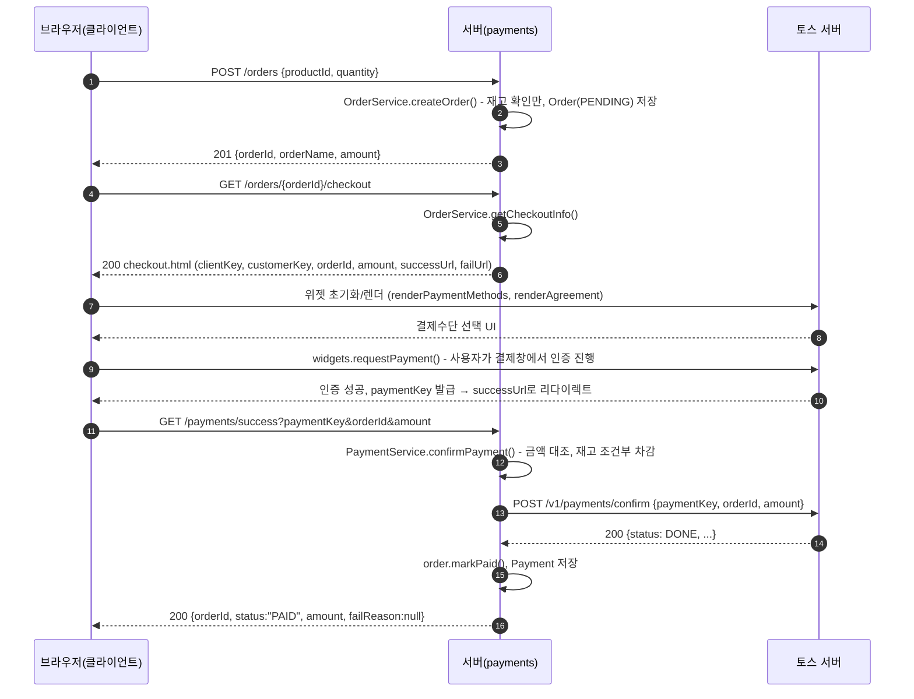
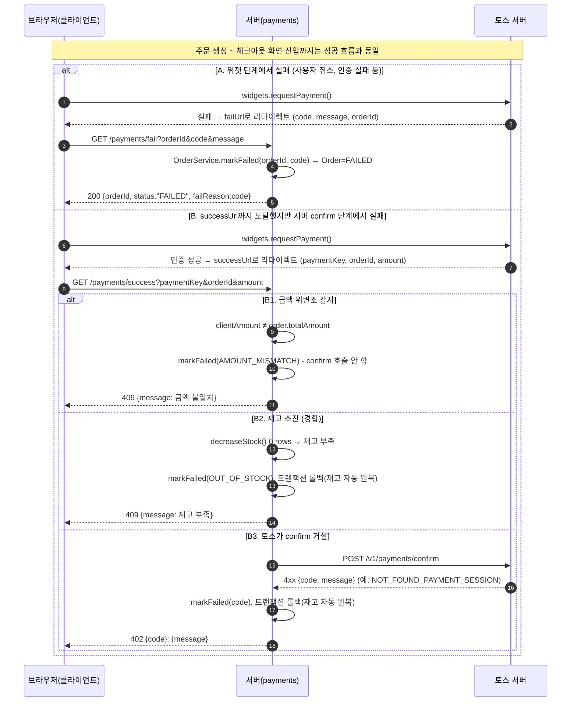
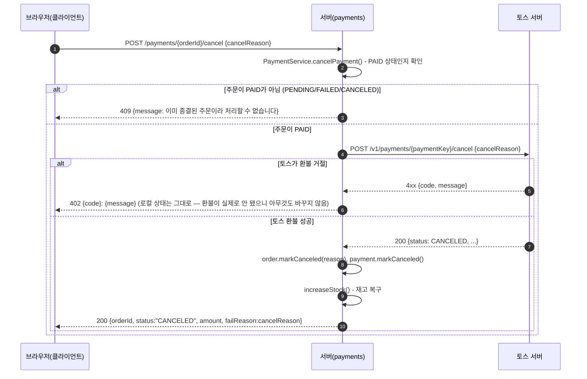

# 결제 성공/실패 흐름 시퀀스 다이어그램 & 테스트 가이드

참여자: **브라우저(클라이언트)** / **서버(payments)** / **토스 서버**

## 1. 성공 흐름



## 2. 실패 흐름



## 3. 취소(환불) 흐름



## 4. 테스트 방법

공통: `./gradlew bootRun`으로 서버 기동(기본 8080), 아래 명령은 이 상태를 전제로 함.

### 성공 케이스

1. 주문 생성해서 `orderId` 확보
   ```bash
   curl -X POST localhost:8080/orders -H "Content-Type: application/json" -d '{"productId":1,"quantity":1}'
   ```
2. 브라우저에서 `http://localhost:8080/orders/{orderId}/checkout` 접속
3. 결제수단 선택 → "결제하기" 클릭 → 테스트 환경이므로 위젯이 안내하는 방식으로 결제 진행(실청구 없음)
4. 완료되면 `/payments/success`로 자동 이동, `{"status":"PAID", ...}` 응답 확인
5. DB에서 `orders.status = PAID`, `payment` 테이블에 새 row(`status = DONE`) 생성 확인

### 실패 케이스

**A. 위젯 단계 실패** — 체크아웃 화면에서 결제창을 띄운 뒤 끝까지 진행하지 않고 **취소/닫기**로 빠져나오기 → `/payments/fail`로 리다이렉트되며 `{"status":"FAILED", "failReason":"..."}` 확인

**B1. 금액 위변조** — 정상 주문 생성 후, `successUrl` 콜백을 흉내내되 `amount`만 다르게 직접 호출
```bash
curl "localhost:8080/payments/success?paymentKey=아무값&orderId={실제orderId}&amount=1"
# → 409, "결제 금액이 일치하지 않습니다"
```

**B2. 재고 소진 경합** — 주문 생성 후, 다른 주문이 먼저 재고를 가져간 상황을 DB에서 강제로 재현
```bash
mysql -uroot -p toss -e "UPDATE product SET stock_quantity=0 WHERE id={productId};"
curl "localhost:8080/payments/success?paymentKey=아무값&orderId={실제orderId}&amount={정상금액}"
# → 409, "재고가 부족합니다"
```
이 경우는 애초에 차감 자체가 안 일어나므로(조건부 UPDATE가 0건 갱신), 재고는 강제로 세팅해둔 값(0) 그대로 유지되는지만 확인하면 됨 — "롤백"이 일어나는 케이스는 아님(B3와 구분).

**B3. 토스 거절** — 정상 주문 생성 후, 존재하지 않는 `paymentKey`로 confirm 유도(실제 토스 서버가 거절 응답)
```bash
curl localhost:8080/products   # confirm 호출 전 재고 수를 먼저 기록해둔다
curl "localhost:8080/payments/success?paymentKey=존재하지않는키&orderId={실제orderId}&amount={정상금액}"
# → 402, 예: "NOT_FOUND_PAYMENT_SESSION: 결제 시간이 만료되어..."
curl localhost:8080/products   # 재고가 "호출 전과 동일한 값"으로 롤백됐는지 비교(재고 차감 → 토스 거절 → 트랜잭션 롤백)
```

### 취소(환불) 케이스

정상 케이스 — `PAID` 상태인 주문(위 성공 케이스로 만든 orderId)을 취소
```bash
curl -X POST localhost:8080/payments/{PAID상태orderId}/cancel -H "Content-Type: application/json" -d '{"cancelReason":"단순 변심"}'
# → 200, {"status":"CANCELED", ...}
```
DB에서 `orders.status = CANCELED`, `payment.status = CANCELED`, 재고가 결제 전 수량으로 복구됐는지 확인

상태 가드 케이스 — `PENDING`/`FAILED` 주문에 취소 시도
```bash
curl -X POST localhost:8080/payments/{PENDING상태orderId}/cancel -H "Content-Type: application/json" -d '{"cancelReason":"단순 변심"}'
# → 409, "이미 종결된 주문이라 처리할 수 없습니다"
```
