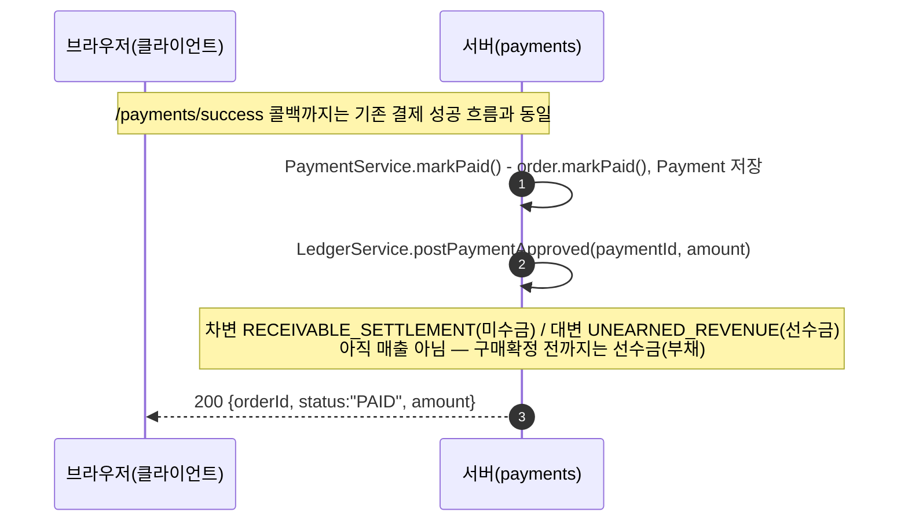
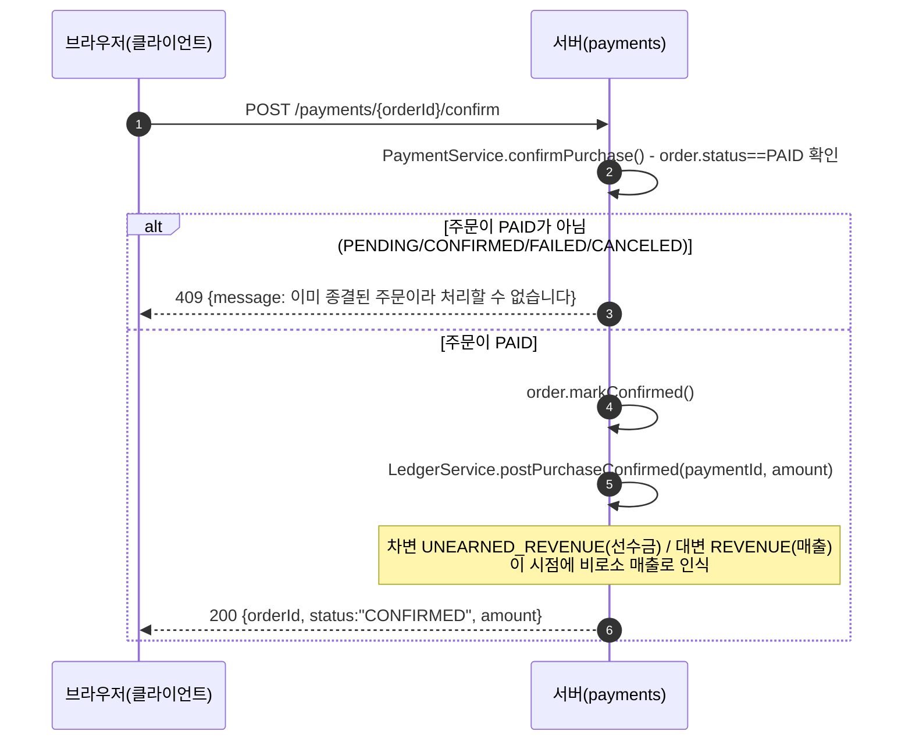
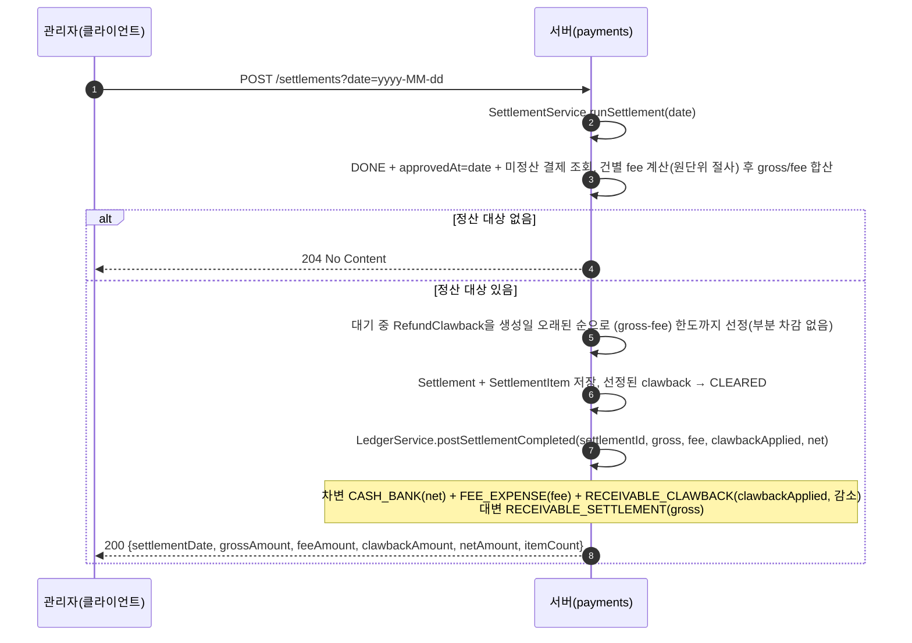
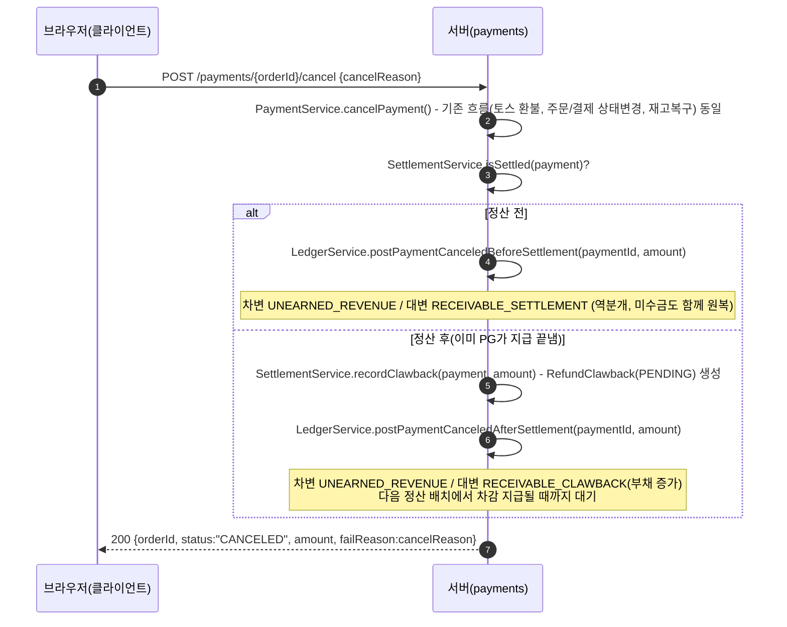

# 선수금·정산·원장 흐름 시퀀스 다이어그램 & 테스트 가이드

참여자: **브라우저/관리자(클라이언트)** / **서버(payments)**. 결제 승인 자체(토스 연동)는 `docs/payment-flow-sequence.md`를 참고 — 여기서는 그 뒤에 이어지는 선수금 인식/구매확정/정산/환수 흐름만 다룬다.

## 1. 결제 승인 → 선수금 인식



## 2. 구매확정 → 매출 인식



구매확정된 주문은 이후 `POST /payments/{orderId}/cancel`을 호출해도 `status != PAID` 가드에 걸려 취소되지 않는다(기존 취소 가드를 그대로 재사용, 별도 수정 없음).

## 3. 정산 배치 실행



같은 날짜에 여러 번 실행해도(수동 트리거라 가능) 이미 정산된 결제는 `isSettled` 필터에서 빠지므로 재실행은 멱등하다 — 다만 이 경우 그 날짜에 `Settlement` 배치가 여러 건 쌓이며, 각 배치는 독립된 기록으로 남는다(합산하지 않음).

## 4. 정산 후 취소 → 환수 대기 생성



## 5. 테스트 방법

공통: `./gradlew bootRun`으로 서버 기동. 아래는 실제 검증에 쓴 순서를 일반화한 것.

### 5.1 선수금 인식 확인

1. 주문 생성 → 브라우저에서 체크아웃 화면 진입해 테스트카드로 결제 완료 (`docs/payment-flow-sequence.md` 참고)
2. 원장/조회로 선수금이 잡혔는지 확인
   ```bash
   curl localhost:8080/receivables
   # unearnedRevenueAmount에 결제 금액이 포함돼 있어야 함, unsettledAmount도 동일하게 증가
   ```

### 5.2 구매확정(매출 인식) 확인

```bash
curl -X POST localhost:8080/payments/{PAID상태orderId}/confirm
# → 200, {"status":"CONFIRMED", ...}
curl localhost:8080/receivables
# unearnedRevenueAmount가 방금 확정한 금액만큼 줄어들어야 함(unsettledAmount는 그대로 — 정산과 무관)
```

구매확정 후 취소 가드 확인:
```bash
curl -X POST localhost:8080/payments/{CONFIRMED상태orderId}/cancel -H "Content-Type: application/json" -d '{"cancelReason":"단순 변심"}'
# → 409, "이미 종결된 주문이라 처리할 수 없습니다"
```

### 5.3 정산 배치 확인

```bash
curl -X POST "localhost:8080/settlements?date=$(date +%F)"
# → 200, {"grossAmount":..., "feeAmount":..., "clawbackAmount":0, "netAmount":..., "itemCount":N}
curl localhost:8080/receivables
# unsettledAmount가 방금 정산된 금액만큼 0에 가깝게 줄어야 함
```

재실행(멱등성) 확인:
```bash
curl -i -X POST "localhost:8080/settlements?date=$(date +%F)"
# 새로 정산할 대상이 없으면 204 No Content
```

### 5.4 정산 후 취소 → 환수 대기 → 다음 정산에서 차감

1. 이미 정산된(확정 전) 주문을 취소
   ```bash
   curl -X POST localhost:8080/payments/{정산됨+PAID상태orderId}/cancel -H "Content-Type: application/json" -d '{"cancelReason":"단순 변심"}'
   curl localhost:8080/receivables
   # pendingClawbackAmount가 취소 금액만큼 증가해야 함
   ```
2. 신규 결제를 하나 더 승인한 뒤 같은 날짜로 재정산
   ```bash
   curl -X POST "localhost:8080/settlements?date=$(date +%F)"
   # netAmount = 이번 gross - fee - 차감된 clawback
   curl localhost:8080/receivables
   # pendingClawbackAmount가 차감된 만큼(전액 차감됐다면 0으로) 줄어야 함
   ```

### 5.5 조회 API

```bash
curl localhost:8080/settlements/2026-08-14
# 그 날짜에 실행된 정산 배치들을 리스트로 반환(여러 번 실행했다면 배치별로 각각)
curl -i localhost:8080/settlements/2000-01-01
# → 404
```
